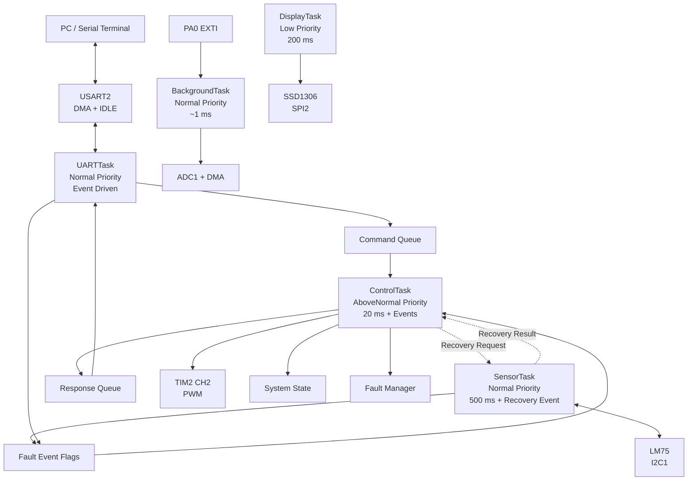
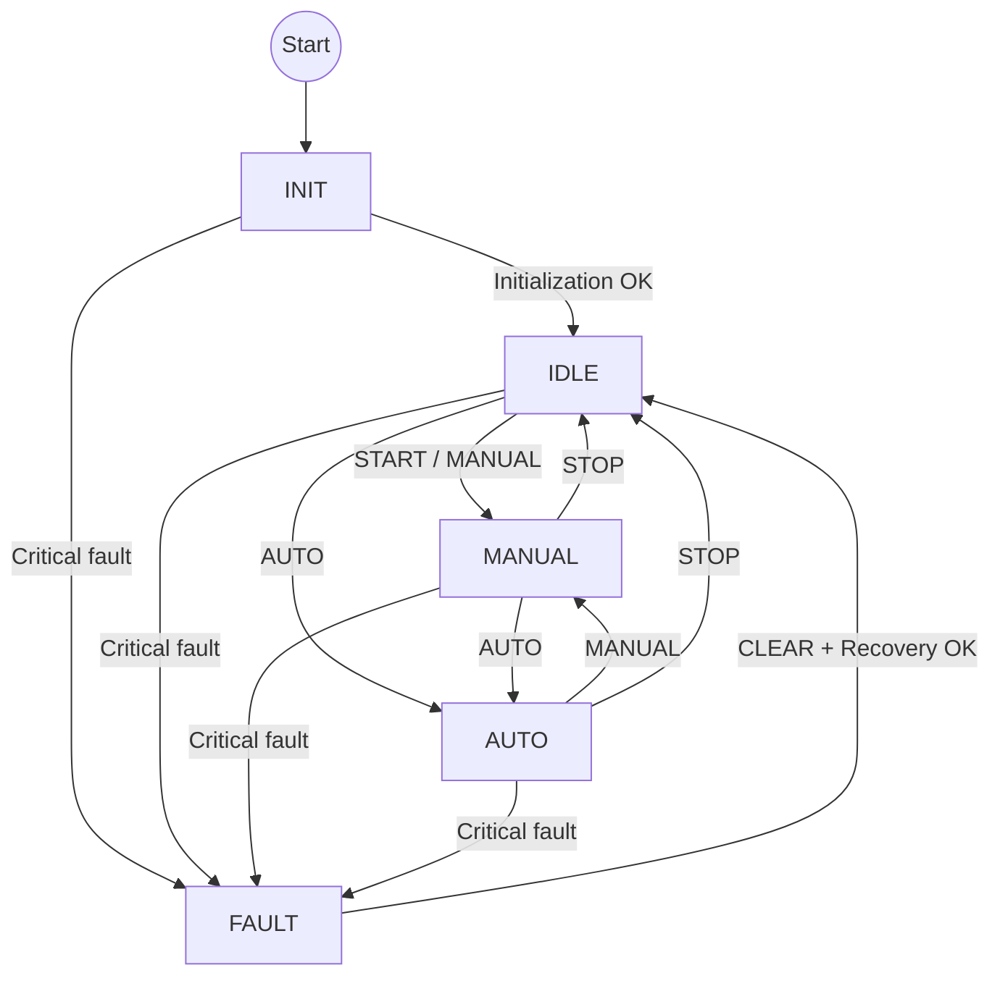
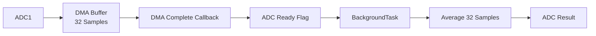
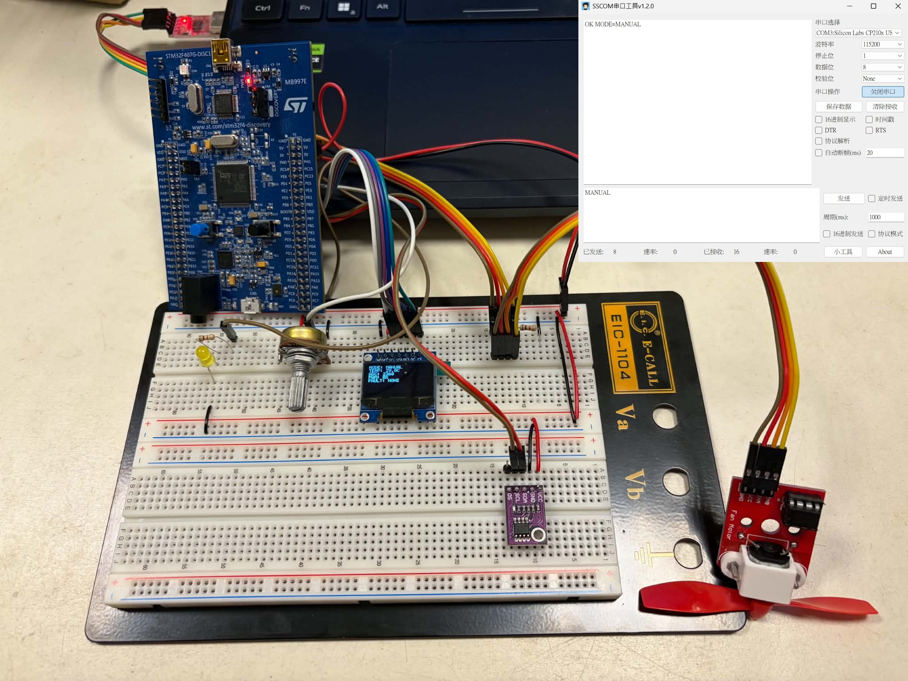
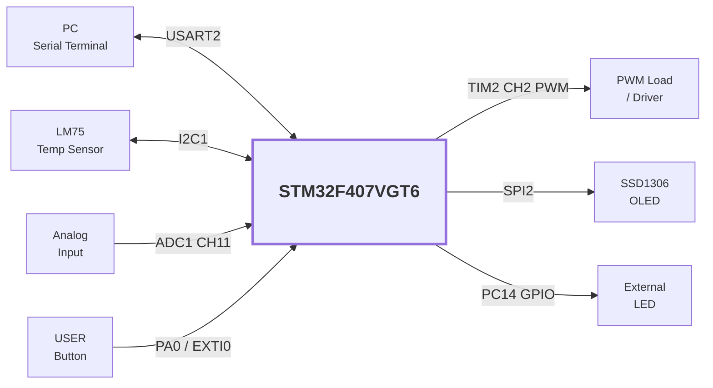

<div align="center">

# STM32F407 FreeRTOS Smart Controller

### Multi-Task Embedded Control System

**STM32F407VGT6 · FreeRTOS · CMSIS-RTOS2 · C · STM32 HAL · DMA · UART · I2C · SPI · PWM · EXTI**

A modular embedded firmware project integrating sensor acquisition,  
command control, automatic PWM regulation, OLED monitoring,  
state management, and fault handling.

</div>

---

## Overview

This project implements a complete embedded control system on the
**STM32F407VGT6** using **FreeRTOS with CMSIS-RTOS2**.

The project was first developed as a bare-metal super-loop application and was
then migrated to a multi-task RTOS architecture. Sensor acquisition, control
logic, UART communication, display updates, and background processing are
separated into dedicated tasks.

### Highlights

- FreeRTOS / CMSIS-RTOS2 multi-task architecture
- Dedicated `ControlTask`, `SensorTask`, `UARTTask`, `DisplayTask`, and `BackgroundTask`
- UART RX using **DMA + IDLE detection**
- ISR-to-task wake-up using **Thread Flags**
- UART control commands transferred through a **Message Queue**
- Control responses transferred through a **Response Queue**
- Fault reports transferred using **Event Flags**
- ADC continuous sampling using **DMA**
- LM75 temperature sensing through **I2C**
- SSD1306 OLED display through **SPI**
- Hardware PWM generation using **TIM2 CH2**
- USER button input using **EXTI**
- `INIT / IDLE / MANUAL / AUTO / FAULT` state machine
- Centralized runtime fault handling
- Automatic fail-safe PWM shutdown
- LM75 / I2C recovery after sensor reconnection
- Runtime stack high-water validation
- Human-readable ASCII command interface
- Modular `.c / .h` firmware structure

---

## System Architecture



### Resource Ownership

| Resource / State | Runtime Owner |
|---|---|
| USART2 RX/TX | `UARTTask` |
| I2C1 / LM75 | `SensorTask` |
| SPI2 / SSD1306 OLED | `DisplayTask` |
| System state | `ControlTask` |
| PWM output | `ControlTask` |
| Fault state | `ControlTask` |
| ADC post-processing | `BackgroundTask` |
| Button event handling | `BackgroundTask` |

---

## RTOS Tasks

| Task | Priority | Period / Trigger | Responsibility |
|---|---|---|---|
| `ControlTask` | AboveNormal | 20 ms + asynchronous events | State machine, PWM control, critical fault handling, recovery result handling |
| `SensorTask` | Normal | 500 ms + recovery request | LM75 acquisition, I2C ownership, sensor recovery |
| `UARTTask` | Normal | Thread Flag events | UART RX processing, command parsing, UART TX |
| `BackgroundTask` | Normal | ~1 ms | ADC DMA post-processing and button event handling |
| `DisplayTask` | Low | 200 ms | OLED status rendering |

The FreeRTOS tick rate is configured to **1000 Hz**.

---

## Operating Modes

| Mode | Description |
|---|---|
| `INIT` | System initialization |
| `IDLE` | System ready, PWM output disabled |
| `MANUAL` | PWM controlled through UART |
| `AUTO` | PWM automatically controlled by temperature |
| `FAULT` | Critical fault state, PWM forced to 0% |

### State Flow



---

## Automatic PWM Control

In `AUTO` mode, PWM duty cycle is calculated according to the LM75
temperature measurement.

| Temperature | PWM |
|---|---:|
| ≤ 25 °C | 0% |
| 32.5 °C | 50% |
| ≥ 40 °C | 100% |

For temperatures between 25 °C and 40 °C:

```text
PWM (%) = (Temperature - 25) × 100 / (40 - 25)
```

This creates a simple linear temperature-control profile.

---

## UART Command Interface

USART2 provides a human-readable command interface.

### Configuration

```text
Baud Rate : 115200
Data Bits : 8
Stop Bits : 1
Parity    : None
Flow Ctrl : None
RX Method : DMA + UART IDLE
```

### Commands

| Command | Description |
|---|---|
| `PING` | Communication test |
| `START` | Enter MANUAL mode |
| `STOP` | Return to IDLE and stop PWM |
| `MANUAL` | Enter MANUAL mode |
| `AUTO` | Enter AUTO mode |
| `PWM <0-100>` | Set PWM duty |
| `STATUS` | Read system status |
| `TEMP` | Read temperature |
| `ADC` | Read ADC value |
| `CLEAR` | Clear fault and attempt recovery |
| `LED ON` | Turn LED on |
| `LED OFF` | Turn LED off |
| `LED TOGGLE` | Toggle LED |

### Example

```text
> PING
PONG

> MANUAL
OK MODE=MANUAL

> PWM 50
OK PWM=50

> STATUS
MODE=MANUAL TEMP=25.5C ADC=2048 PWM=50 FAULT=0x0000
```

---

## Peripheral Integration

| Peripheral | Configuration | Function |
|---|---|---|
| ADC1 | 12-bit + DMA | Analog signal acquisition |
| DMA2 | Circular transfer | ADC sample buffering |
| USART2 | 115200 + DMA | Command interface |
| I2C1 | 100 kHz | LM75 temperature sensor |
| SPI2 | Master | SSD1306 OLED |
| TIM2 CH2 | ~1 kHz | PWM generation |
| EXTI0 | Rising edge | USER button |
| GPIO PC14 | Output | External LED |

---

## ADC + DMA

ADC1 continuously samples an analog input using DMA.

A circular DMA buffer stores:

```text
32 samples
```

After the DMA buffer is completed, a lightweight callback marks new ADC data
as available. `BackgroundTask` performs the averaging operation outside the ISR.



Raw ADC range:

```text
0 ~ 4095
```

Voltage conversion:

```text
Voltage (mV) = ADC × 3300 / 4095
```

---

## UART DMA Reception

UART reception uses DMA together with UART IDLE detection.

The RX event callback stores the received length and wakes `UARTTask` using a
Thread Flag. Command parsing is then performed in task context.


Control responses are returned through a separate Response Queue so USART2 TX
remains owned by `UARTTask`.

---

## Fault Management

The firmware uses a centralized fault bitmask.

| Fault | Critical |
|---|---|
| Temperature sensor communication failure | Yes |
| Invalid UART command | No |
| Invalid parameter | No |

Runtime fault reports from `SensorTask` and `UARTTask` are forwarded through
RTOS Event Flags. `ControlTask` is the single runtime writer of the fault state.

The LM75 must fail for **three consecutive sensor cycles** before a critical
temperature-sensor fault is reported.

A critical fault forces:

```text
State = FAULT
PWM   = 0%
```

### Recovery

The user can issue:

```text
CLEAR
```

`ControlTask` sends a recovery request to `SensorTask`. Since `SensorTask` owns
I2C1, sensor recovery remains in the same task.

The recovery sequence is:

```text
HAL_I2C_DeInit()
→ HAL_I2C_Init()
→ LM75 ready check
→ temperature read
→ report recovery result to ControlTask
```

If recovery succeeds:

```text
FAULT → IDLE
PWM   = 0%
```

If recovery fails, the controller remains in `FAULT`.

---

## OLED Monitoring

The SSD1306 OLED displays system information in real time.

Example:

```text
MODE: MANUAL
TEMP: 25.5C
ADC : 2048
PWM : 50%
FAULT: NONE
```

SPI2 is used for OLED communication.

Control pins:

| Signal | Pin |
|---|---|
| CS | PE7 |
| DC | PE8 |
| RESET | PE9 |

---

## Hardware Overview

### MCU

**STM32F407VGT6**

Clock configuration:

```text
SYSCLK : 168 MHz
HCLK   : 168 MHz
PCLK1  : 42 MHz
PCLK2  : 84 MHz
```

### Main Components

- STM32F407VGT6 development board
- LM75 temperature sensor
- SSD1306 SPI OLED
- Analog input / potentiometer
- External LED
- ST-LINK debugger
- USB-UART adapter
- Breadboard and jumper wires

---

## Software Structure

```text
Core/
├── Inc/
│   ├── FreeRTOSConfig.h
│   ├── analog_input.h
│   ├── fault_manager.h
│   ├── oled.h
│   ├── protocol.h
│   ├── pwm.h
│   ├── system_state.h
│   └── temperature_sensor.h
│
└── Src/
    ├── analog_input.c
    ├── fault_manager.c
    ├── freertos.c
    ├── main.c
    ├── oled.c
    ├── protocol.c
    ├── pwm.c
    ├── stm32f4xx_hal_timebase_tim.c
    ├── system_state.c
    └── temperature_sensor.c

Middlewares/
└── Third_Party/
    └── FreeRTOS/
```

### Module Responsibilities

| Module | Responsibility |
|---|---|
| `analog_input` | ADC DMA acquisition and averaging |
| `temperature_sensor` | LM75 I2C communication and recovery |
| `pwm` | PWM generation and duty control |
| `oled` | SSD1306 SPI display driver |
| `protocol` | UART ASCII command parser |
| `system_state` | State transition management |
| `fault_manager` | Fault bitmask storage and queries |
| `main` | Hardware initialization, RTOS object creation, task entry functions, application coordination |
| `freertos` | FreeRTOS hooks and CubeMX-generated RTOS support |
| `FreeRTOSConfig.h` | FreeRTOS kernel configuration |

---

## FreeRTOS Configuration

```text
Tick Rate                      : 1000 Hz
Stack Overflow Check           : Mode 2
Newlib Reentrancy              : Enabled
Heap Implementation            : heap_4
FreeRTOS Heap Size             : 15360 bytes
Max Syscall Interrupt Priority : 5
HAL Time Base                  : TIM6
```

---

## Runtime Stack Validation

Each application task is allocated:

```text
1024 bytes
```

Stack usage was validated with `osThreadGetStackSpace()` after normal
operation, UART command handling, invalid commands, sensor fault injection,
failed recovery, successful recovery, and OLED updates.

| Task | Allocated Stack | Minimum Observed Free Stack | Approx. Maximum Used |
|---|---:|---:|---:|
| `BackgroundTask` | 1024 B | 864 B | 160 B |
| `SensorTask` | 1024 B | 736 B | 288 B |
| `DisplayTask` | 1024 B | 520 B | 504 B |
| `ControlTask` | 1024 B | 296 B | 728 B |
| `UARTTask` | 1024 B | 624 B | 400 B |

`ControlTask` showed the highest stack usage while still retaining about
29% stack headroom during regression testing.

---

## Design Principles

### Keep ISRs Lightweight

Interrupt callbacks perform minimal work and defer application processing to
tasks.

Examples:

```text
UART RX Event ISR
→ store RX length
→ set UARTTask Thread Flag

EXTI ISR
→ set button event flag
```

### Use the Appropriate RTOS Primitive

- **Thread Flags**: task wake-up and event notification
- **Message Queues**: ordered command and response transfer
- **Event Flags**: aggregated fault reporting

### Single-Owner Resources

```text
USART2      → UARTTask
I2C1 / LM75 → SensorTask
SPI2 / OLED → DisplayTask
PWM / State → ControlTask
Fault State → ControlTask
```

### Fail-Safe Output

Critical faults force:

```text
PWM = 0%
```

### Integer-Based Temperature

Temperature is stored as:

```text
Celsius × 10
```

Example:

```text
25.5 °C → 255
```

---

## Build

### Requirements

- STM32CubeIDE
- STM32 HAL
- ST-LINK

Clone the repository:

```bash
git clone https://github.com/John0729/STM32F407-FreeRTOS-Smart-Controller.git
```

Import into STM32CubeIDE:

```text
File
→ Import
→ General
→ Existing Projects into Workspace
```

Then:

```text
Build Project
→ Connect ST-LINK
→ Run / Debug
```

The CubeMX hardware configuration is stored in:

```text
STM32F407VGT6_RTOS_Smart_Controller.ioc
```

---

## Demo

### Suggested Test Flow

```text
1. PING
2. STATUS
3. MANUAL
4. PWM 25
5. PWM 50
6. PWM 100
7. ADC
8. TEMP
9. AUTO
10. Disconnect LM75
11. Wait for FAULT
12. STATUS
13. CLEAR while LM75 is disconnected
14. Reconnect LM75
15. CLEAR
16. STATUS
17. MANUAL / PWM 50 / STOP
```

### Hardware Setup





---

## Skills Demonstrated

This project demonstrates practical experience with:

`STM32` · `Embedded C` · `FreeRTOS` · `CMSIS-RTOS2` · `Task Scheduling`  
`Thread Flags` · `Message Queues` · `Event Flags` · `HAL` · `GPIO` · `EXTI`  
`ADC` · `DMA` · `UART` · `I2C` · `SPI` · `PWM` · `Timers` · `State Machine`  
`Fault Handling` · `Sensor Recovery` · `Stack Validation` · `Serial Protocol` · `Git`

---


---

## Project Status

**Firmware implementation and hardware regression testing complete.**

The firmware is currently in a code-freeze state. Remaining work is limited to
documentation improvements and demo media.
